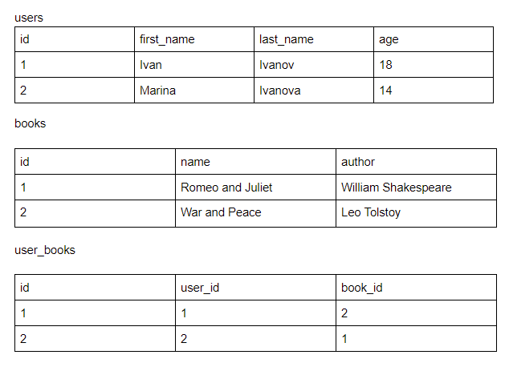

# Первое задание

Есть три таблицы:



Необходимо написать SQL запрос, который найдет и выведет всех читателей, возраста от 7 и до 17 лет, которые взяли только 2 книги и все книги одного и того же автора.

Формат вывода:
```
ID, Name (first_name  last_name), Author, Books (Book 1, Book 2, ...) 
1, Ivan Ivanov, Leo Tolstoy, Book 1, Book 2, Book 3
```

## Решение

Запрос
```mysql
SELECT
    u.id AS ID,
    CONCAT(u.first_name, " ", u.last_name) AS NAME,
    b.author AS Author,
    COUNT(b.id),
    GROUP_CONCAT(b.name SEPARATOR ', ') AS Books
FROM
    users AS u
INNER JOIN user_books AS ub
ON
    u.id = ub.user_id
INNER JOIN books AS b
ON
    b.id = ub.book_id
WHERE
    u.age >= 7 AND u.age <= 17
GROUP BY
    u.id,
    b.author
HAVING
    COUNT(b.id) = 2
```

[***Тестовый дамп БД***](test.sql)

# Второе задание

```
Для выполнения этого задания используйте 

Laravel 7.3
PHP 7.3.14
10.4.12-MariaDB


Необходимо реализовать на  фреймворке LARAVEL RESTful API для работы с курсами обмена валют для BTC. В качестве источника курсов будем использовать: https://blockchain.info/ticker и будем работать только с этим методом.


Данное API будет доступно только после авторизации. Все методы будут приватными.
Написать middleware, который закрывает методы к апи и проверяет токен, сам токен для экономии времени можно статично записать в файл .env 


Для авторизации будет использоваться фиксированный токен (64 символа включающих в себя a-z A-Z 0-9 а так-же символы - и _ ), передавать его будем в заголовках запросов. Тип Authorization: Bearer.

Важно:

Весь код, которые производит какие-либо вычисления или операции с базой должен быть написать в сервисах. Все сервисы инициализировать через DI в контроллерах в методе __construct, либо в в экшене контроллера.

Для фильтрации, построения ответов от апи использовать библиотеку
https://github.com/spatie/laravel-query-builder

Все апи должны возвращать ресурсы или коллекции ресурсов в случае успеха

https://laravel.com/docs/8.x/eloquent-resources


Формат ответа API: JSON (все ответы при любых сценариях JSON)

Все значения курса обмена должны считаться учитывая нашу комиссию = 2%


Примеры запросов
GET http://base-api.url/api/v1/rates?filter[currency]=USD // фильтр по валюте
 
GET http://base-api.url/api/v1/rates // все курсы

API должен иметь 2 метода:

rates: Получение всех курсов с учетом комиссии = 2% (GET запрос) в формате:
{
	“USD” : <rate>,
...
}

В случае ошибки связанной с токеном: код ответа должен быть 403, в случае успеха код ответа 200 + данные


Сортировка от меньшего курса к большему курсу.

В качестве параметров может передаваться интересующая валюта, в формате USD,RUB,EUR и тп В этом случае, отдаем указанные в качестве параметра currency значения.


Запрос на конвертацию валют, результат запроса сохранять в базу

2. POST http://base-api.url/api/v1/convert


Параметры:

currency_from: USD // исходная валюта
currency_to: BTC // валюта в которую конвертируем
value: 1.00 // количество единиц исходной валюты


convert: Запрос на обмен валюты c учетом комиссии = 2%. POST запрос с параметрами:
currency_from: USD
currency_to: BTC
value: 1.00

или в обратную сторону

currency_from: BTC
currency_to: USD
value: 1.00

В случае успешного запроса, отдаем:

{
		“currency_from” : BTC,
	“currency_to” : USD,
	“value”: 1.00,
	“converted_value”: 1.00,
	“rate” : 1.00,
	“created_at”: TIMESTAMP

}

В случае ошибки:
{
	“status”: “error”,
	“code”: 403,
	“message”: “Invalid token”
}

Важно, минимальный обмен равен 0,01 валюты from
Например: USD = 0.01 меняется на 0.0000005556 (считаем до 10 знаков)
Если идет обмен из BTC в USD - округляем до 0.01
```

## Первоначальная установка
- Скопировать .env.example в .env, настроить соединение с БД, поставить значение API_KEY 
- composer install
- php artisan migrate
- php artisan import:rates

После этого можно обращаться к API

GET /api/v1/rates

POST /api/v1/convert

## Архитектура

Архитектура приложения соответствует принципам SOLID, использует композицию через механизм dependency
injection для внедрения объектов, ответственных за различные операции, конкретная реализация которых 
может быть легко замена динамически ("на лету") ме меняя существующего кода, а реализую существующие 
интерфейсы в новых классах

Например, для того, чтобы делать импорт из другого источника, достаточно написать новый класс,
реализующий интерфейс RateFetcherContract, а так же новую фабрику, реализующую интерфейс RateEntityFactoryContract
и использовать их в соответствующих местах (например прописать в сервис контейнер по-умолчанию)

То же самое касается механизмов расчета наценки (2%) и конвертации туда/обратно - достаточно
написать классы, реализующие соответствующие интерфейсы, описанные ниже

Текущие реализации интерфейсов устанавливается в AppServiceProvider

### Контракты

#### Единичные контракты
- RateEntityContract - Базовый интерфейс сущности курса
- RateConverterContract - преобразование одной валюты в другую
- RateFetcherContract - получение списка курсов
- RateTransformerContract - преобразование сумм для курсов, то есть в данном конкретном случае применение 2%
- RateEntityFactoryContract - фабрика сущности курса

#### Репозитории
- RateRepositoryContract - репозиторий курсов
    - ApiRateRepositoryContract - репозиторий курсов для работы с нашими методами API 

#### Службы
- ImportServiceContract - служба импортирования данных курсов в БД
- RateConverterServiceContract - служба для конвертации, использует 

### Реализации

#### RateEntityContract
- MemoryRateEntity - служит для импорта курсов из внешнего источника
- Rate - Eloquent-модель курса, так же реализующая интерфейс RateEntityContract 

#### RateConverterContract
- DefaultRateConverter - стандартный конвертер "из" и "в" BTC

#### RateFetcherContract
- BlockchainInfoFetcher - конкретный "получатель" курсов из сервиса https://blockchain.info/ticker

#### RateTransformerContract
- DefaultRateTransformer - стандартный преобразователь курсов (+ 2%)

#### RateEntityFactoryContract
- BlockchainInfoRateFactory - фабрика объектов при получении из BlockchainInfoFetcher

#### RateRepositoryContract
- RateCollectionRepository - хранение курсов в коллекции

##### ApiRateRepositoryContract
- RateDatabaseRepository - хранение курсов в БД

#### ImportServiceContract
- ImportService - импорт данных из источника RateFetcherContract установленного в сервис провайдере

#### RateConverterServiceContract
- RateConverterService - стандартный сервис конвертации, работает с текущими реализациями контрактов
ApiRateRepositoryContract, RateTransformerContract и RateConverterContract для получения, конвертации 
и наценки
